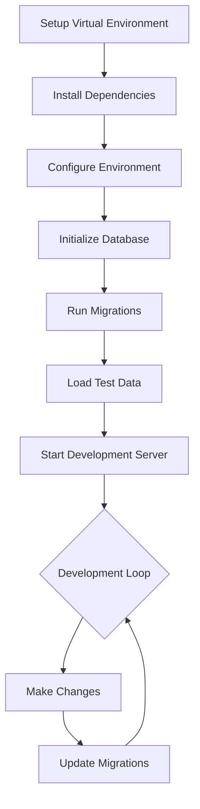
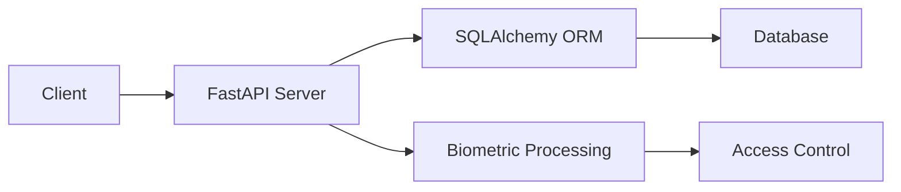

# 🔐 Biometric Control Access System

[](https://www.python.org/downloads/)
[](https://fastapi.tiangolo.com/)
[](https://alembic.sqlalchemy.org/)

A modern biometric access control system built with Python, FastAPI, and SQLAlchemy.

## 📋 Table of Contents
- [Requirements](#requirements)
- [Installation](#installation)
- [Database Setup](#database-setup)
- [Data Loading](#data-loading)
- [Running the Application](#running-the-application)
- [Project Structure](#project-structure)

## 🔧 Requirements
- Python 3.9 or higher
- pip package manager
- Virtual environment module (venv)

## 💻 Installation

1. Clone the repository:
```bash
git clone <repository-url>
cd biometric-control-access
```

2. Create and activate virtual environment:
```bash
python3 -m venv .venv
source .venv/bin/activate  # On Windows use: .venv\Scripts\activate
```

3. Install dependencies:
```bash
pip install -r requirements.txt
```

4. Set up environment variables:
   - Download the `.env` file from the [Google Drive](https://drive.google.com/drive/folders/1p4tAIsf14WVmowL-IwcBU3StA_897baN?usp=drive_link)
   - Place it in the project root directory

## 🗄️ Database Setup

1. Initialize Alembic:
```bash
# First, backup the existing env.py file
cp alembic/env.py /path/to/backup/env.py

# Remove existing alembic files
rm -rf alembic/
rm alembic.ini

# Initialize new alembic configuration
alembic init alembic

# Restore the custom env.py file to the new alembic directory
cp /path/to/backup/env.py alembic/env.py
```

2. Generate and apply migrations:
```bash
# Generate initial migration
alembic revision --autogenerate -m "Creacion de modelos y sus tablas"

# Apply migrations
alembic upgrade head
```

## 📊 Data Loading

Load initial data using the provided scripts:

```bash
# Load seed data (if available)
python -m app.db.seed_script

# Generate test data (optional)
python -m app.db.test-data-generator
```

## 🚀 Running the Application

Start the development server:
```bash
uvicorn app.main:app --reload
```

The API will be available at `http://localhost:8000`

## 📁 Project Structure

```
.
├── alembic/                        # Database migrations
│   ├── env.py
│   ├── README
│   ├── script.py.mako
│   └── versions/
├── alembic.ini                     # Alembic configuration
├── app/
│   ├── api/                        # API endpoints and dependencies
│   │   ├── deps.py
│   │   ├── __init__.py
│   │   └── v1/
│   │       ├── api.py
│   │       ├── endpoints/
│   │       │   ├── access.py
│   │       │   ├── auth.py
│   │       │   ├── biometric.py
│   │       │   ├── __init__.py
│   │       │   └── reports.py
│   │       └── __init__.py
│   ├── core/                       # Core functionality
│   │   ├── config.py
│   │   ├── __init__.py
│   │   ├── security.py
│   │   └── validation_utils.py
│   ├── db/                         # Database modules
│   │   ├── __init__.py
│   │   ├── seed_script.py
│   │   ├── session.py
│   │   └── test-data-generator.py
│   ├── __init__.py
│   ├── main.py                     # FastAPI application entry point
│   ├── models/                     # Database models
│   │   ├── access_log.py
│   │   ├── base_class.py
│   │   ├── base.py
│   │   ├── __init__.py
│   │   └── user.py
│   ├── schemas/                    # Pydantic schemas
│   │   ├── access_log.py
│   │   ├── __init__.py
│   │   └── user.py
│   └── services/                   # Business logic services
│       ├── biometric.py
│       ├── fingerprint_service.py
│       └── __init__.py
├── docker-compose.yml              # Docker configuration
├── __init__.py
├── PENDING_README.md
├── README.md                       # Project documentation
├── requeriments.txt               # Project dependencies
└── scripts/                       # Utility scripts
    ├── create_admin.py
    └── __init__.py
```

## 🔄 Development Workflow



## 📈 System Architecture



## 📝 License

[...]

---
For more information or support, please contact the development team at [cborja@discdc.com](mailto:cborja@discdc.com).